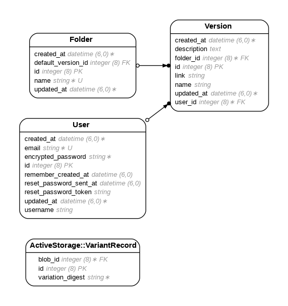

# ManaVer

## Description
ManaVer is a file storage and managing system built to help marketing teams organize, update, and collaborate without the chaos of email chains or confusing folders. Upload files, choose the default, and ensure your team always has the most updated version.


## Live link: 
[https://manaver-capstone-project.onrender.com](https://manaver-capstone-project.onrender.com)


## Features
- Upload files and manage multiple versions
- Set a default version for each file for instant view and download
- Folders shared across users for collaborative work


## Table of Contents
- [Installation](#installation)
- [Usage](#usage)
- [Database schema ERD](#database-schema-erd)
- [Contributing](#contributing)
- [License](#license)


## Installation
1. Clone the repository:
```
https://github.com/grace1501/manaver-capstone-project.git
```
2. Navigate to the project directory:
```
cd yourproject
```
3. Install the required gems:
```
bundle install
```
4. Set up the database:
```
rails db:setup
```
5. Start the Rails server:
```
rails server
```

## Usage

1. Start the Rails server:
```
rails server
```
2. Open your browser and navigate to http://localhost:3000
3. Follow the on-screen instructions to use the application


## Database Schema (ERD)


## Contributing

Contributions are welcome! Please follow these guidelines:

1. Fork the repository
2. Create a new branch 
```
git checkout -b feature-branch
```
3. Commit your changes 
```
git commit -m 'Add some feature'
```
4. Push to the branch 
```
git push origin feature-branch
```
5. Open a pull request


## Contact   

Grace Do - [gracedo1501@gmail.com](mailto:gracedo1501@gmail.com)

Project Link: [https://github.com/grace1501/manaver-capstone-project](https://github.com/grace1501/manaver-capstone-project)

---
## License

MIT License
Copyright (c) 2025 Grace Do

Permission is hereby granted, free of charge, to any person obtaining a copy of this software and associated documentation files (the “Software”), to deal in the Software without restriction, including without limitation the rights to use, copy, modify, merge, publish, distribute, sublicense, and/or sell copies of the Software, and to permit persons to whom the Software is furnished to do so, subject to the following conditions:

The above copyright notice and this permission notice shall be included in all copies or substantial portions of the Software.

THE SOFTWARE IS PROVIDED “AS IS”, WITHOUT WARRANTY OF ANY KIND, EXPRESS OR IMPLIED, INCLUDING BUT NOT LIMITED TO THE WARRANTIES OF MERCHANTABILITY, FITNESS FOR A PARTICULAR PURPOSE AND NONINFRINGEMENT. IN NO EVENT SHALL THE AUTHORS OR COPYRIGHT HOLDERS BE LIABLE FOR ANY CLAIM, DAMAGES OR OTHER LIABILITY, WHETHER IN AN ACTION OF CONTRACT, TORT OR OTHERWISE, ARISING FROM, OUT OF OR IN CONNECTION WITH THE SOFTWARE OR THE USE OR OTHER DEALINGS IN THE SOFTWARE.
